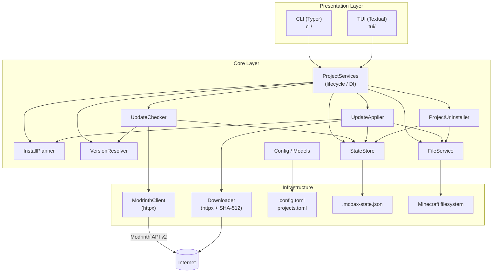
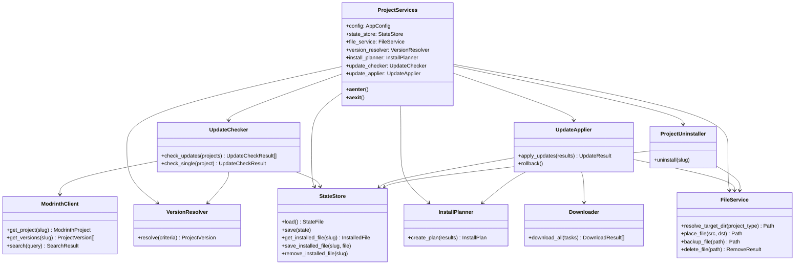
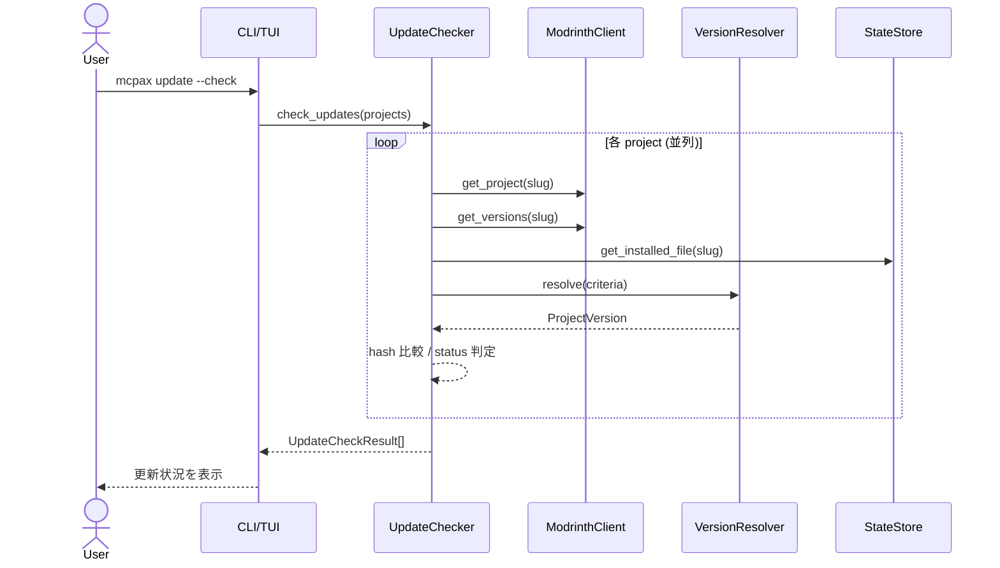
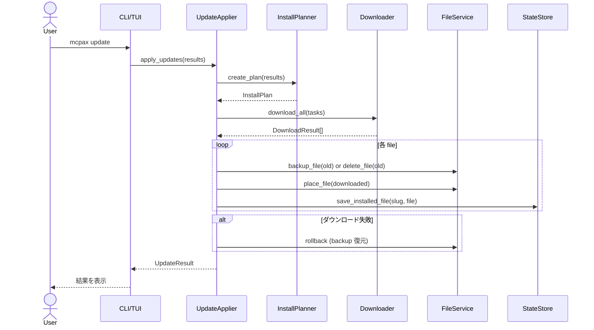
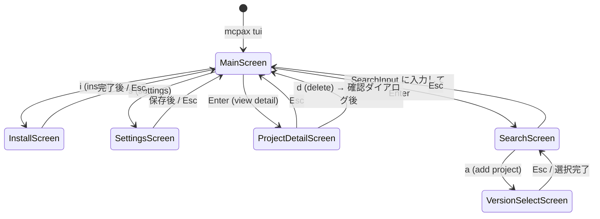

# アーキテクチャ設計書

## 1. レイヤー構成



CLI/TUI は `ProjectServices` 経由でのみ core を呼び出す。business logic は core に置き、Presentation Layer には置かない。

## 2. ディレクトリ構成

```text
mcpax/
├── pyproject.toml
├── src/
│   └── mcpax/
│       ├── core/                  # Business logic layer
│       │   ├── api.py             # Modrinth API client
│       │   ├── cache.py           # API response cache
│       │   ├── config.py          # Config file read/write
│       │   ├── downloader.py      # Download + SHA-512 verification
│       │   ├── exceptions.py      # Domain exceptions
│       │   ├── file_service.py    # File placement / backup / delete
│       │   ├── install_planner.py # Download task planning (pure)
│       │   ├── models.py          # Pydantic data models
│       │   ├── protocols.py       # Interface definitions (Protocol)
│       │   ├── services.py        # DI composition root
│       │   ├── state_store.py     # .mcpax-state.json persistence
│       │   ├── uninstaller.py     # Project uninstall
│       │   ├── update_applier.py  # Update execution
│       │   ├── update_checker.py  # Update check
│       │   └── version_resolver.py# Version selection logic
│       ├── cli/                   # CLI interface (Typer)
│       │   ├── app.py
│       │   ├── commands/          # add / remove / list / search / install / update / ...
│       │   ├── formatters.py
│       │   └── shared.py
│       └── tui/                   # TUI interface (Textual)
│           ├── app.py
│           ├── screens/           # main / search / detail / install / settings / ...
│           └── widgets/           # ProjectTable / SearchInput / ProgressPanel / ...
└── tests/
    ├── conftest.py
    ├── unit/
    │   ├── test_*.py              # Core unit tests
    │   └── tui/                   # TUI screen / widget tests
    └── fixtures/                  # config.toml / projects.toml
```

## 3. Core コンポーネント詳細



## 4. データフロー

### 更新確認 (update check)



### 更新適用 (update apply)



## 5. TUI 画面遷移



> Search 画面への遷移は専用キーではなく、Main 画面上の `SearchInput` ウィジェットにクエリを入力して Enter することで開く。

## 6. 設計方針

- **依存方向**: Presentation → Core のみ。逆方向は禁止
- **業務ロジックの配置**: CLI/TUI には置かない。Core に集中させる
- **副作用の分離**: `InstallPlanner` は pure function。副作用は `UpdateApplier` に限定
- **インフラ詳細の隠蔽**: HTTP / filesystem / TOML/JSON の詳細は Core 内の専用クラスに閉じる
- **テスタビリティ**: 外部依存 (API, filesystem) は `ProjectServices` が DI で注入。Protocol で境界を定義
- **段階的改善**: 大規模 rewrite ではなく Fowler-style の小さな refactoring を積み上げる

## 7. テスト対象と優先度

| モジュール | テスト観点 |
|---|---|
| `VersionResolver` | compatibility / channel / pinned version 解決ロジック |
| `InstallPlanner` | actionable update から download task 生成 (pure function) |
| `UpdateChecker` | update status 判定、pinned / non-pinned 結果生成 |
| `UpdateApplier` | download failure、partial success、backup、rollback |
| `FileService` | target directory 解決、place / backup / delete |
| `StateStore` | missing / corrupted state の load/save、installed file helpers |
